<h1 align="center">Odai Ahmad</h1>

<p align="center">
  
</p>

<p align="center">
  
  
  
</p>

### GitHub activity

<p align="center">
  
</p>

---

### About

```python
class Odai:
    role  = "Backend & AI Engineer"
    focus = ["APIs", "automation integrations", "RAG / LLM services"]
    stack = ["Python", "FastAPI", "Django", "TypeScript"]
    now   = "building, maintaining, and fixing automation integrations"
```

### Tech stack

<p>
  
</p>

### What I work on

<table>
<tr>
<td width="33%" valign="top">

**Backend systems**<br/>
REST and WebSocket APIs with FastAPI and Django, background jobs with Celery and Redis, deployed with Docker and Nginx.

</td>
<td width="33%" valign="top">

**Applied AI**<br/>
RAG chatbots, LLM-backed services and agents, and ML models from training through deployment.

</td>
<td width="33%" valign="top">

**Automation**<br/>
Building, maintaining, and fixing integrations, output schemas, and AI actions for workflow automation platforms.

</td>
</tr>
</table>

### Journey

<p align="center">
  
</p>

<details>
<summary><b>Read the full story</b></summary>
<br/>

<p align="center">
  
</p>

</details>
